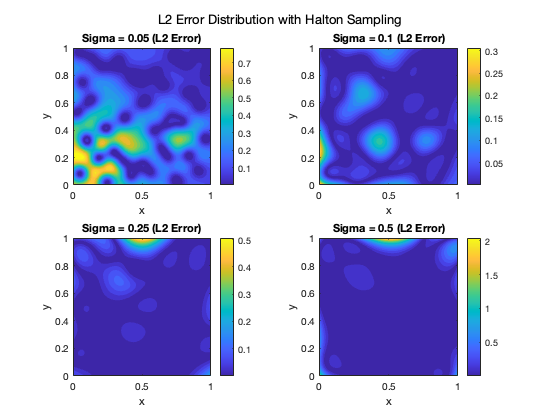

# Scattered Data Approximation Projects

## Overview
This repository contains two projects focusing on scattered data approximation using different techniques and kernels:
1. Tent Map Approximation using Gaussian RBFs
2. 2D Franke Function Approximation

## Project 1: Tent Map Approximation

### Description
Implementation of the tent map approximation using various kernel methods:
- Gaussian RBF
- Polynomial Kernel
- Exponential Kernel

### Key Features
- Multiple initial conditions testing (x₀ = 0.1, 0.5, 0.7, 0.9)
- Parameter optimization (σ values: 0.1, 0.5, 1, 2)
- Comparative analysis of different kernels
- Error analysis and visualization

### Results
- Perfect approximation achieved for x₀ = 0.5
- Exponential kernel showed best overall performance
- Gaussian kernel performed well with small σ values
- Polynomial kernel showed consistent but higher errors
  

## Project 2: Franke Function Approximation

### Description
2D approximation of the Franke function using two sampling methods:
- Lattice (meshgrid) sampling
- Halton sequence sampling

### Key Features
- Implementation of Gaussian RBF interpolation
- Parameter tuning for optimal σ values
- Comparative analysis of sampling methods
- Error visualization and analysis

### Results
#### Lattice Sampling
- Optimal σ = 0.25 (RMSE: 0.0151)
- Best balance between local and global approximation
- Smooth error distribution


#### Halton Sampling
- Optimal σ = 0.1 (RMSE: 0.051057)
- Better performance with smaller σ values
- More uniform error distribution


## Requirements
- MATLAB R2019b or later
- MATLAB Statistics and Machine Learning Toolbox

## Usage
### Tent Map Approximation
```matlab
tent_other_kernel.m
Franke Function Approximation
MATLAB
```
FrankeApproximation.m      % For lattice sampling
FrankeApproximation_Halton.m   % For Halton sequence sampling
## Author
Haowei(Alice) Chen

GitHub: @alicechen216
Email: haoweichen@usf.edu
